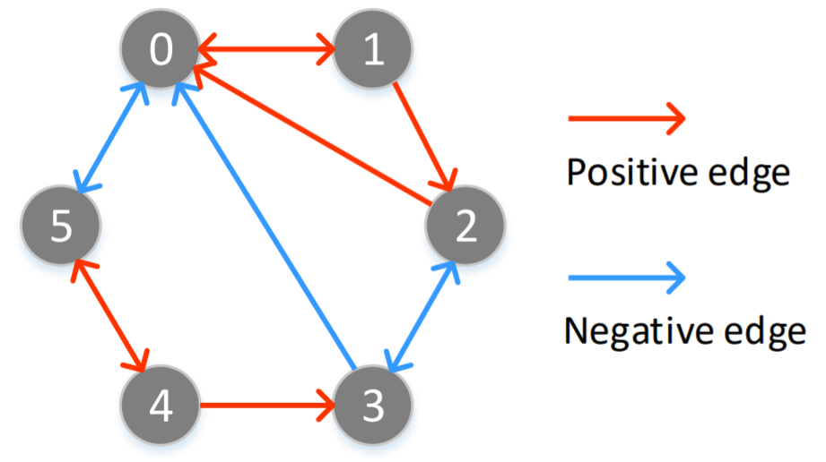

Here we provide the code of simulation experiments to empirically validate Eq.(6).

Of course W cannot be infinite when using explicit sampling.
Thus, we first set W (i.e., `num_walks` in the script) to a relatively large value (e.g., 10,000).
We then perform random walk and count the number of samples about positve proximity. Next, we can calculate the left term and right term of Eq.(6).

For example, in the following graph, when setting W=10,000 and h=2, we have

 = \[0.5071 0.     0.2448 0.     0.     0.    \]

 = [0.5  0.   0.25 0.   0.   0.  ]

 can approximate  with lower error as W increases.
