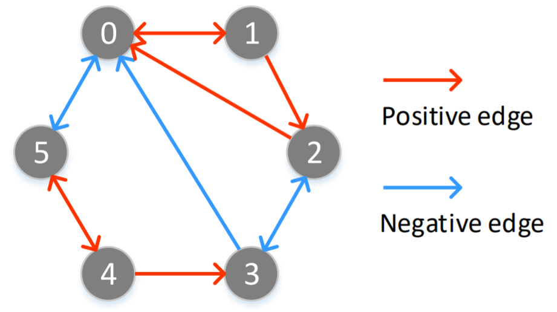

## Proof
Given a path, if it contains **even** negative edges, we then refer to it as a positive path; Otherwise, we refer to it as a negative path.

Let  denote the probabilities of starting from  and reaching at  along h-step positive paths.

Let  denote the probabilities of starting from  and reaching at  along h-step negative paths.

We have that the probability of traversing from  to  along h-step paths is , i.e., .
And the difference between  and  is given by .  

We then have .
According to the law of large numbers, we have \infty}\sharp_h(V_i,V_j)}{W}" title="p_1=\frac{\lim_{W->\infty}\sharp_h(V_i,V_j)}{W}" />

That is, we have \infty}\sharp_h(vi,vj)}{W}=\frac{(\hat{P}^h_{ij}+P^h_{ij})}{2}" title="\frac{\lim_{W->\infty}\sharp_h(vi,vj)}{W}=\frac{(\hat{P}^h_{ij}+P^h_{ij})}{2}" />.

## Instructions for simulation results
Furthermore, we provide the code of simulation experiments to empirically validate Eq.(6).

Of course, W cannot be infinite when using explicit sampling.
Thus, we first set W (i.e., `num_walks` in the ``exp.py) to a relatively large value (e.g., 10,000).
We then perform random walk and count the number of samples about positve proximity. Next, we can calculate the left term and right term of Eq.(6).

For example, in the following graph, when setting W=10,000 and h=2, we have

 = \[0.5071 0.     0.2448 0.     0.     0.    \]

 = [0.5  0.   0.25 0.   0.   0.  ]

 can approximate  with lower error as W increases.
